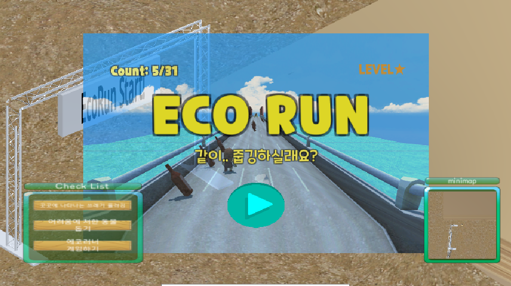

# 플로깅 아일랜드 (Plogging Island)
> 친환경 교육 메타버스 서비스

메타버스 속에서 여러가지 체험과 게임을 통해서 올바른 친환경 관련 내용을 학습하고, 다양한 활동을 통해 에코 마일리지를 획득할 수 있는 친환경 교육 프로그램.


## 주요기능

- 강연장 : 학습, OX 퀴즈, 분리수거 게임
- 에코샵 : 친환경 제품 구입, 기업 홍보관
- 에코 팩토리 : 자원순환 과정 견학
- 에코런 : 플러깅 아케이드 게임

## 세부기능
|구분|기능|설명|비고|
|:---|:---|:---|:---|
|1|강연장|OX 퀴즈, 분리수거 게임 및 학습을 통하여 친환경 교육 프로그렘 체험||
|2|에코샵|친환경 제품 사이트 방문||
|3|에코 팩토리|실제 공장 처리와 비슷한 컨베이어 벨트를 재현함으로써 가상 환경 속에서 체험||
|4|에코런|게임을 통해서 에코 마일리지 획득||

## 아키텍처


## 설치


```sh
sudo git clone https://lab.ssafy.com/ssafy_opensource/ploggingisland

```

## 사용 예시

### 1. Outside

- 곳곳에 나타나는 쓰레기 플러깅
- 어려움에 처한 동물 돕기
- 에코러너 게임하기

### 2. Lecture


- 에코 캠페인 학습하기
- 친환경 관련 퀴즈 풀기
- 분리수거 게임하기


### 3. Factory


- 자연 순환 공장에서 분리수거 된 쓰레기들을 어떻게 처리하는지 확인
- 실제 공장 처리와 비슷한 컨베이어 벨트를 재현함으로써 가상 환경 속에서 체험이 가능


### 4. Shop


- 친환경 제품 사이트 방문


### 5. Game




- 에코런 게임


- 재활용 게임


## 개발 설정

```sh
make install
npm test
```

## 릴리즈 히스토리

* 0.0.1
    * Work in progress

## 추가정보

- 양준영 – ssafy_coach_77@ssafy.com
- 박지수 – ssafy_coach_75@ssafy.com
- 서정욱 – ssafy_coach_76@ssafy.com


## 기여

1. 해당 프로젝트를 Fork 하세요 (<https://lab.ssafy.com/ssafy_opensource/ploggingisland/fork>)
2. feature 브랜치를 생성하세요 (`git checkout -b feature/fooBar`)
3. 변경사항을 commit 하세요 (`git commit -am 'Add some fooBar'`)
4. 브랜치에 Push 하세요 (`git push origin feature/fooBar`)
5. 새로운 Merge Request를 요청하세요

## 라이선스

Distributed under the SGPL license. See [License](LICENSE) for more information.